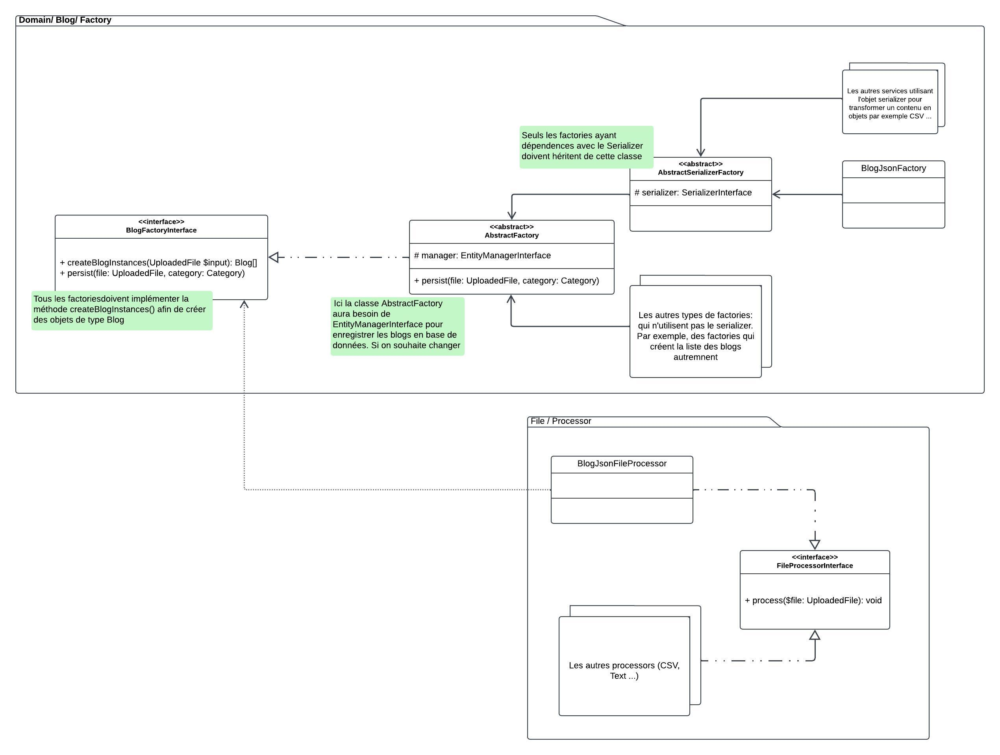
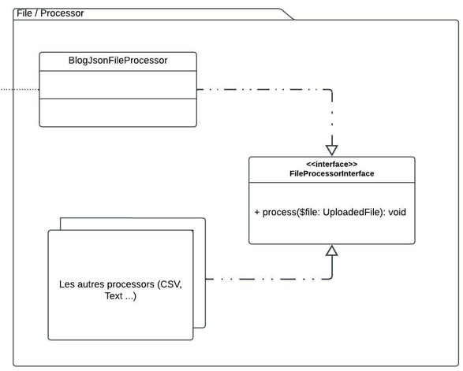
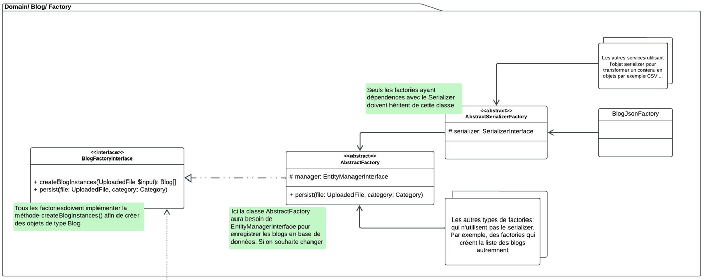

**Facade Design Pattern**

the `App\File\Processor\FileProcessorInterface::process` method is used to process the file uploaded. a single class of
a simple method can perform huge/complicated process.

the client code must inject the `FileProcessorInterface` to process the uploaded file.

for better maintainability and readability of the code, we might to implement `SOLID` principles. for that we decide to
have one class `BlogJsonFileProcessor` that will implement the `FileProcessorInterface`. this way we can decouple the
client code from implementation et make it work with abstraction. also we can implement as many file processors as we
want in the future, like a `BlogCsvFileProcessor`.

**Factory Design Pattern**

we are using the FDP to create `App\Entity\Blog` instance. that why we decide to
have `App\Domain\Blog\Factory\BlogJsonFactory` to create blogs instances based on json content. however, we wanted to
use the `Symfony\Component\Serializer` component to ease the creation of blogs. we can use the serializer to create
objects from the CSV format. that's why we decided to make the `App\Domain\Blog\Factory\BlogJsonFactory` extends
the `App\Domain\Blog\Factory\AbstractSerializerFactory` abstract class which has a dependency with the serializer. all
factories that would use the serializer to create instances shall extend this class. no matter what factory is, all
those factories will persist data into the database that is why make
the `App\Domain\Blog\Factory\AbstractSerializerFactory` extend `App\Domain\Blog\Factory\AbstractFactory` which depends
on the `EntityManagerInterface`. we can do better of course.

again, to make the `App\Domain\Blog\Factory\BlogJsonFactory` decoupled from the implementations, we decided to make *
all* factories implement an interface `App\Domain\Blog\Factory\BlogFactoryInterface` that contains 2 main
methods: `createBlogInterfaces` and `persist`. the `persist` method is specially used in
the `App\Domain\Blog\Factory\BlogJsonFactory` .

---

thanks to this, we can switch between different implementations using techniques
like `Symfony\Component\DependencyInjection\Attribute\Target`
and `Symfony\Component\DependencyInjection\Attribute\Autowire` . also we can
use `Symfony\Component\DependencyInjection\Attribute\AsAlias` to create aliases. 