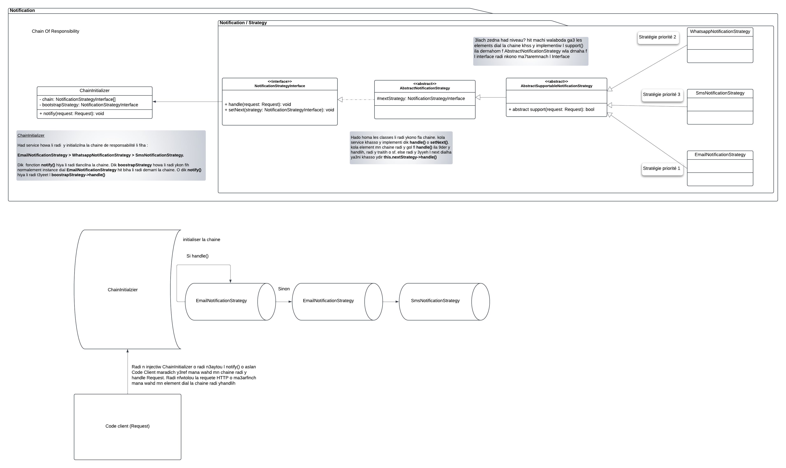
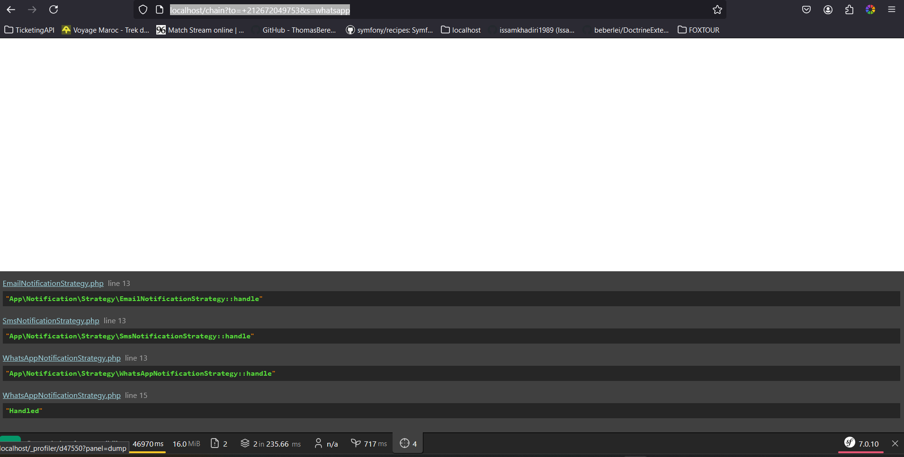

Code client interagie avec le service `src/Notification/ChainInitializer.php`. C'est le service dans lequel la chaine
est configurée.

```php
class ChainInitializer
{
    private NotificationStrategyInterface $bootstrapStrategy;

    /** @var NotificationStrategyInterface[] */
    private array $chain;

    public function __construct(#[TaggedIterator(tag: 'app.chain_handler')] iterable $chain)
    {
        $strategies = \iterator_to_array($chain);
        $currentStrategy = $this->bootstrapStrategy = \array_shift($strategies);

        \array_walk($strategies, function (NotificationStrategyInterface $strategy) use (&$currentStrategy) {
            $currentStrategy->setNext($strategy);
            $currentStrategy = $strategy;
        });

        $this->chain = $strategies;
    }
    
    ...
}
```

ce service recoit une collection de services spéciaux (taggés avec `app.chain_handler`). ces handlers sont triés par
ordre de priorité (voir le fichier `code/config/services.yaml`). le service ayant la priorité haute est le service avec
lequel la chaine va commencer.

le premier de la liste sera donc mis dans `$bootstrapStrategy` puis retiré de la chaine. ensuite, on boucle sur le reste
de la chaine pour configurer pour chaque service son successeur.

avec cette configuration, nous pouvons tester la chaine en allant à la page `http://localhost/chain`.

**exemples**:

- http://localhost/chain?to=+212672049753&s=whatsapp&message=some+message
- http://localhost/chain?to=+212672049753&s=sms&message=some+content
- http://localhost/chain?to=khadiri.issam@gmail.com&s=email&content=some+content

pour chacun de ces exemples, il faut suivre le profiler qui va vous afficher l'ordre d'exécution de la chaine 

